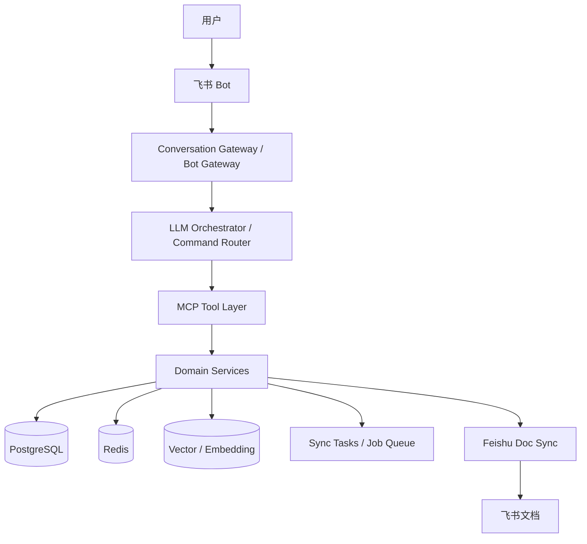

<callout background-color="light-blue">
本稿为 knowledgeBook 的主技术方案，目标是覆盖系统完整功能与完整技术边界，而不是只描述某次单点改造。

阅读方式：
- 如果你要理解系统整体实现、模块、协议、数据与流程，优先读本文件；
- 如果你只关心某次架构升级的新增与改动，请阅读对应的差异技术方案。
</callout>

## 一、文档信息

| 项目 | 内容 |
| --- | --- |
| 文档名称 | knowledgeBook 技术方案文档（完整功能版） |
| 文档版本 | v2.1 |
| 文档状态 | 进行中，持续更新 |
| 更新时间 | 2026-03-29 |
| 适用范围 | 产品完整能力的系统设计与实施参考 |

---

## 二、方案目标

本方案覆盖 knowledgeBook 的完整技术能力，包括：
- 飞书接入
- 候选知识提取与确认
- 分类推荐与分类管理
- 相似知识识别与冲突处理
- 检索与答案组织
- 知识更新、软删除、恢复
- 飞书文档同步与同步回收
- 版本、审计、任务补偿与基础部署

---

## 三、总体技术原则

### 3.1 核心原则
- 数据库是唯一事实源
- 飞书文档是派生展示层
- 所有正式状态变更必须由后端确定性执行
- 新增知识必须经过候选 / 草稿与确认流程
- 所有正式知识都必须有版本记录
- 所有关键动作都应有日志与可追溯链路

### 3.2 演进原则
- 主技术方案描述完整功能基线
- 单次版本升级单独补充差异技术方案
- 避免把主技术文档改写成只服务一次迭代的临时说明

---

## 四、总体架构

## 4.1 架构总览



## 4.2 分层职责

| 层级 | 主要职责 |
| --- | --- |
| 接入层 | 飞书事件接入、消息标准化、回调与幂等处理 |
| 编排层 | 意图识别、命令解析、知识提取、响应组织 |
| MCP 层 | 向 LLM 暴露标准能力，做 schema、权限、幂等与错误封装 |
| 领域服务层 | 执行确定性业务逻辑，推进状态机与事务 |
| 存储与基础设施层 | 存储知识、版本、映射、索引、任务、缓存 |
| 外部集成层 | 飞书文档同步、飞书回调、未来第三方集成 |

---

## 五、模块设计

## 5.1 接入层模块

### 5.1.1 bot-gateway
职责：
- 飞书事件接收
- challenge / 验签处理
- 文本消息与卡片回调解析
- 重复投递幂等去重
- 消息回包

### 5.1.2 conversation-context
职责：
- 组装统一请求对象
- 注入 open_id、chat_id、message_id、trace_id
- 注入最近一次操作上下文

## 5.2 编排层模块

### 5.2.1 command-router
职责：
- 解析显式命令输入
- 将 `/kb` 命令转换为标准操作请求

### 5.2.2 intent-parser
职责：
- 识别自然语言意图
- 提取槽位信息
- 判断是否需要追问或澄清

### 5.2.3 knowledge-extractor
职责：
- 从原始输入中提取标题、摘要、关键点、标签、分类提示
- 生成候选知识草稿

### 5.2.4 response-composer
职责：
- 把后端结果组装成候选卡片、检索答案、冲突说明、维护反馈

## 5.3 MCP 工具层

### 5.3.1 embedded-mcp-server
职责：
- 在现有 `app-server` 内直接提供真正的 MCP Server 能力
- 统一注册 tools / resources（如后续需要）
- 统一输入输出 schema
- 对 LLM 保持稳定接口

实现原则：
- **协议做真**：直接采用真正 MCP 的工具定义与返回结构
- **部署做轻**：本阶段先嵌入 `app-server`，不单独拆远程 MCP 服务
- **能力解耦**：MCP server 只做协议适配、参数校验和路由，不直接承载领域逻辑

### 5.3.2 mcp-authz
职责：
- 校验用户上下文
- 控制读写资源权限
- 防止跨用户越权

## 5.4 领域服务层

### 5.4.1 draft-service
职责：
- 创建候选草稿
- 维护待确认、忽略、稍后处理状态
- 承接确认前知识整理流程

### 5.4.2 category-service
职责：
- 管理分类树
- 生成分类路径
- 支持新增、改名、迁移、停用

### 5.4.3 classifier-service
职责：
- 分类推荐
- 高置信自动分类判断

### 5.4.4 similarity-service
职责：
- 相似知识召回
- 判断合并、补充、冲突或直接新建

### 5.4.5 knowledge-service
职责：
- 创建正式知识
- 更新知识
- 调整分类
- 软删除、恢复
- 触发版本与同步任务

### 5.4.6 merge-service
职责：
- 执行知识合并
- 记录主从关系与版本变更

### 5.4.7 search-service
职责：
- 检索知识
- 聚合答案证据
- 返回相关知识、冲突知识和文档链接

### 5.4.8 doc-sync-service
职责：
- 将知识同步到飞书文档结构
- 维护 doc / anchor / block 映射
- 支持显式同步回收

### 5.4.9 cleanup-service
职责：
- 处理超期软删除清理
- 补偿失败同步任务
- 清理过期或异常状态任务

### 5.4.10 audit-service
职责：
- 记录关键操作日志
- 记录用户确认行为
- 记录同步、冲突、合并与回收行为

---

## 六、分层协议设计

## 6.1 接入层 → 编排层

### 协议：`NormalizedConversationRequest`
```json
{
  "traceId": "tr_123",
  "source": "feishu",
  "user": {
    "openId": "ou_xxx"
  },
  "conversation": {
    "chatId": "oc_xxx",
    "messageId": "om_xxx"
  },
  "message": {
    "type": "text",
    "text": "帮我记一下今天讨论的结论"
  },
  "context": {
    "lastAction": "search_knowledge"
  }
}
```

## 6.2 编排层内部协议

### 协议：`IntentUnderstandingResult`
```json
{
  "intent": "create_knowledge",
  "confidence": 0.93,
  "needsClarification": false,
  "slots": {
    "rawText": "帮我记一下今天讨论的结论"
  }
}
```

### 协议：`ExtractedKnowledgeDraft`
```json
{
  "title": "某功能方案结论",
  "summary": "总结本次讨论的主要结论。",
  "keyPoints": ["结论1", "结论2"],
  "tags": ["方案", "设计"],
  "categoryHint": "工作/项目/方案",
  "confidence": 0.88
}
```

## 6.3 编排层 → MCP 层

### 协议：`ToolCallRequest`
```json
{
  "tool": "create_knowledge_draft",
  "idempotencyKey": "tr_123:create_knowledge_draft",
  "actor": {
    "openId": "ou_xxx"
  },
  "input": {
    "rawContent": "帮我记一下今天讨论的结论"
  }
}
```

### 协议：`ToolCallResult`
```json
{
  "success": true,
  "tool": "create_knowledge_draft",
  "data": {
    "draftId": 501,
    "status": "PENDING_CONFIRMATION"
  },
  "error": null
}
```

## 6.4 MCP 层 → 领域服务层

### 协议：`ServiceCommand`
```json
{
  "command": "CreateKnowledgeFromDraft",
  "actorUserId": 1,
  "payload": {
    "draftId": 501,
    "confirmedAction": "create"
  }
}
```

### 协议：`ServiceCommandResult`
```json
{
  "status": "ok",
  "entityType": "knowledge_item",
  "entityId": 1001,
  "state": "ACTIVE"
}
```

## 6.5 搜索展示协议

### 协议：`KnowledgeSearchResult`
```json
{
  "answer": "当前命中的主要结论是……",
  "evidence": [
    {
      "knowledgeId": 1001,
      "title": "方案结论",
      "summary": "摘要内容",
      "docAnchorLink": "https://example.feishu.cn/docx/..."
    }
  ],
  "related": [],
  "conflicts": []
}
```

---

## 七、MCP 工具清单

## 7.1 草稿相关
- `create_knowledge_draft`
- `get_knowledge_draft`
- `confirm_knowledge_draft`
- `cancel_knowledge_draft`
- `defer_knowledge_draft`

## 7.2 分类与相似能力
- `recommend_category`
- `check_similarity`
- `get_similarity_candidates`
- `attach_as_supplement`
- `resolve_knowledge_conflict`

## 7.3 正式知识能力
- `get_knowledge`
- `update_knowledge`
- `merge_knowledge`
- `delete_knowledge`
- `restore_knowledge`

## 7.4 检索与展示能力
- `search_knowledge`
- `get_related_knowledge`
- `get_conflicting_knowledge`

## 7.5 文档能力
- `sync_knowledge_to_doc`
- `sync_from_doc`
- `sync_topic_summary_to_doc`

---

## 八、数据模型设计

## 8.1 核心实体
- `users`
- `categories`
- `knowledge_drafts`
- `knowledge_items`
- `knowledge_versions`
- `category_recommendations`
- `knowledge_similarity`
- `knowledge_conflicts`
- `knowledge_merge_relations`
- `doc_sync_mappings`
- `sync_tasks`
- `audit_logs`

## 8.2 `knowledge_drafts`
职责：保存待确认的候选知识。

建议字段：
- `id`
- `user_id`
- `raw_content`
- `normalized_title`
- `normalized_summary`
- `normalized_points` JSONB
- `tags` TEXT[]
- `recommended_category_path`
- `llm_confidence`
- `status`
- `created_at`
- `updated_at`

## 8.3 `knowledge_items`
职责：保存正式知识主记录。

建议字段：
- `id`
- `user_id`
- `draft_id`
- `title`
- `summary`
- `content_markdown`
- `key_points` JSONB
- `tags` TEXT[]
- `category_id`
- `category_path`
- `status`
- `current_version`
- `doc_anchor_link`
- `removed_at`
- `purge_at`
- `created_at`
- `updated_at`

## 8.4 `knowledge_versions`
职责：保存知识历史版本。

建议字段：
- `knowledge_id`
- `version_no`
- `title`
- `summary`
- `content_markdown`
- `key_points`
- `change_type`
- `change_reason`
- `operator_user_id`
- `created_at`

## 8.5 `category_recommendations`
职责：记录分类推荐结果。

## 8.6 `knowledge_similarity`
职责：记录候选知识与已有知识的相似关系。

建议字段：
- `draft_id`
- `knowledge_id`
- `similarity_score`
- `relation_type`
- `reason`
- `created_at`

## 8.7 `knowledge_conflicts`
职责：记录冲突知识的处理结果。

## 8.8 `knowledge_merge_relations`
职责：记录被合并知识与主知识关系。

## 8.9 `doc_sync_mappings`
职责：记录知识与飞书文档位置映射。

## 8.10 `sync_tasks`
职责：记录同步任务与补偿状态。

## 8.11 `audit_logs`
职责：记录用户动作、状态变化与关键操作。

---

## 九、状态机设计

## 9.1 草稿状态机
```plaintext
EXTRACTED
  ↓
PENDING_CONFIRMATION
  ├── CONFIRMED
  ├── IGNORED
  ├── DEFERRED
  └── CONFLICT_PENDING
```

## 9.2 正式知识状态机
```plaintext
ACTIVE
  ├── UPDATED
  ├── MERGED_INTO_OTHER
  ├── SOFT_DELETED
  └── CONFLICT_MARKED
```

## 9.3 文档同步状态机
```plaintext
PENDING → RUNNING → SUCCESS
                 ↘ FAILED → RETRYING → PENDING
```

---

## 十、关键业务流程

## 10.1 新增知识流程
```plaintext
输入内容
→ 生成候选草稿
→ 分类推荐
→ 相似知识检测
→ 用户确认
→ 正式知识入库
→ 写版本
→ 同步飞书文档
```

## 10.2 相似知识处理流程
```plaintext
候选草稿生成后
→ 相似知识召回
→ 判断 merge / supplement / conflict / new
→ 用户选择处理方式
→ 写入正式知识或合并关系
```

## 10.3 查询知识流程
```plaintext
用户提问
→ 检索 ACTIVE 知识
→ 聚合证据
→ 组织答案
→ 返回答案 + 条目 + 文档链接
```

## 10.4 更新知识流程
```plaintext
用户发起更新
→ 定位知识
→ 修改标题 / 内容 / 分类
→ 写新版本
→ 触发文档增量同步
```

## 10.5 软删除 / 恢复流程
```plaintext
用户发起软删除
→ 写 removed_at / purge_at
→ 默认退出检索
→ 用户可在 30 天内恢复
→ 超期自动清理
```

## 10.6 文档同步回收流程
```plaintext
用户手动改文档
→ 显式发起 sync-from-doc
→ 读取修改内容
→ 与当前版本对比
→ 写新版本
→ 重新同步文档
```

---

## 十一、检索与索引策略

## 11.1 当前推荐策略
- PostgreSQL Full Text Search
- 标签匹配
- 分类路径过滤
- 向量召回用于语义检索与相似知识检测

## 11.2 推荐实现原则
- MVP 阶段优先保持架构简单
- 首选 PostgreSQL + pgvector 组合
- 不急于引入独立向量数据库

---

## 十二、文档同步设计

## 12.1 同步原则
- 飞书文档仅做派生展示
- 按分类层级组织子文档与标题
- 每条知识维护稳定位置链接

## 12.2 文档结构建议
```plaintext
知识库总览文档
├── 一级分类子文档
│   ├── 二级分类子文档
│   │   ├── 三级标题 / 子文档
│   │   │   ├── 知识条目
```

## 12.3 手改回收原则
- 默认不自动回写
- 仅显式 sync-from-doc 才回收
- 回收成功后必须生成新版本

---

## 十三、部署形态

## 13.1 推荐部署单元
- `app-server`
- `app-worker`
- PostgreSQL
- Redis

## 13.2 主要职责划分
- `app-server`：接入、编排、**嵌入式 MCP Server**、知识管理、查询接口
- `app-worker`：分类推荐、相似计算、文档同步、清理补偿

## 13.3 运行要求
- 健康检查：`/healthz`、`/readyz`
- 可通过 Docker Compose 一键启动

---

## 十四、风险与控制

## 14.1 模型幻觉
控制方式：
- 保留 raw_content
- 必须确认后入库
- 答案展示绑定 evidence

## 14.2 去重误判
控制方式：
- 默认推荐，不自动强合并
- 冲突强制用户选择
- 所有合并与冲突处理可追溯

## 14.3 文档与数据库不一致
控制方式：
- 数据库始终为唯一事实源
- 文档同步失败进入任务补偿
- 文档回收只走显式入口

## 14.4 边界失控
控制方式：
- LLM 不能直接写库
- 所有能力统一走 MCP 层
- 所有正式写操作统一走领域服务事务

---

## 十五、文档边界说明

本文件是完整功能主技术方案，负责描述系统完整基线。

若后续出现单次版本升级或专项架构调整：
- 本文件继续维护完整技术基线
- 新增单独的“差异技术方案”文档描述改动点

不要把主技术文档收缩成只覆盖某一次升级任务的说明稿。
